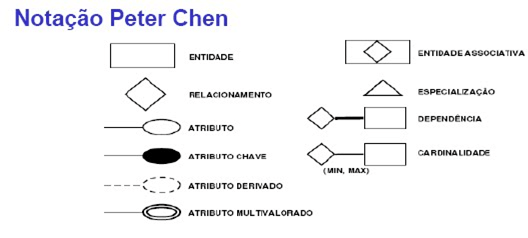
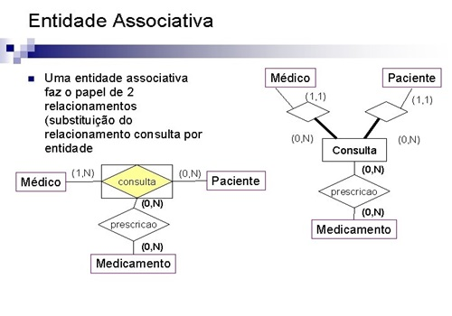
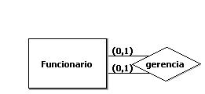
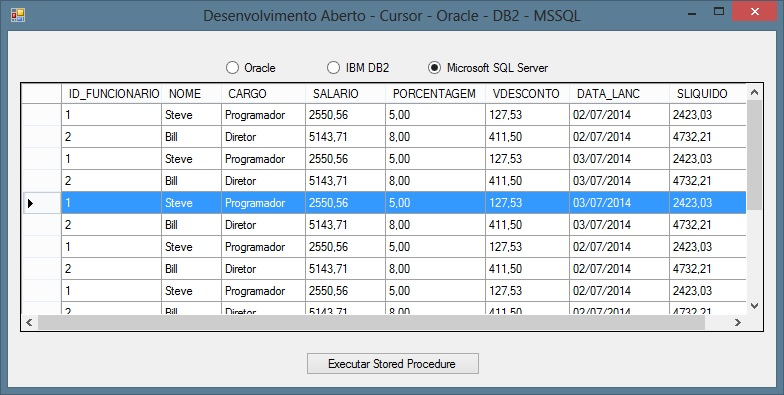

\newpage

# Objetivo

Estudo dirigido de MySQL.

# Referência

Vídeo aulas "O curso completo de Banco de Dados e SQL, sem mistérios" - Udemy.

\newpage

# Módulo 2 - Teoria

## Modelagem

Obs.: alguns softwares (ex.: brModelo) chamam a modelagem lógica de modelo conceitual.\

1. Analise de requisitos\
  - Modelo das necessidades do Cliente, o que é do interesse do cliente e o que ele precisa no banco de dados.\
  - Processos a serem controlados pelo sistema.\
  - É uma fase de muita conversa e reunião com o cliente para investigar as regras do negocio.\

2. processos de modelagem\

  - Fases 01 e 02 do projeto de banco de dados são feitos pelo administrador de dados:\
    i. Modelo conceitual\
      - Rascunho dos requisitos do projeto.\
      - Desenho conceitual.\
          
    ii. Modelo lógico\
      - Coloca os requisitos num programa de diagramas.\
      - Cria **entidades**, posteriormente serão tabelas.\
      - Cria **atributos**, posteriormente serão campos, colunas nas tabelas.\
      - **Atributos identificador**, posteriormente será **Chave Primaria** *Artificial*.\
        - Normalmente leva o nome "ID" + "o_nome_da_tabela".\
      - Modelo **entidades-relacionamentos**, define os relacionamentos entre os agentes.\
        - Relacionamentos:\
          - Obrigatoriedade\
          A obrigatoriedade de preencher as duas tabelas/entidades.\
          Tipos:\
          0\
          Não existe obrigatoriedade, se entrar com dados em um, não é obrigado a entrar com dados no outro.\
          1\
          Existe obrigatoriedade, se entrar com dados em um, obrigatoriamente é necessario entrar com dados no outro.\
          - Cardinalidade\
          Maximo de preenchimentos:\
          Se obrigatoriedade 0, no minimo 0 e no maximo n dados.\
          Se obrigatoriedade 1, no minimo 1 e no maximo n dados.\
        - tipos de relacionamentos de entidade:\
          - (1,1)\
          É obrigatorio, pode entrar apenas com 1 dado.\
          - (0,1)\
          Não é obrigadorio, quando entrar, entrar com 1 dado.\
          - (1,n)\
          É obrigatorio, pode entrar com varios dados.\
          - (0,n)\
          Não é obrigatorio, pode entrar com varios dados.\
        - Como ler os relacionamentos entre entidades:\
        Exemplos:\
          - (1,1) -> (0,n)\
          Ignorar a primeira coordenanda de obrigatoriedade dos dois relacionamentos, e fica 1 para n, logo "um para muitos".\
          - (0,n) -> (0,1)\
          Ignorar a primeira coordenanda de obrigatoriedade dos dois relacionamentos, e fica n para 1, logo "muitos para um".\
  
  - Fase 03 do projeto de banco de dados é feita tanto pelo administrador de bancos de dados(DBA) quanto administrador de dados(AD):\
    
    iii. Modelo físico\
      - Criando banco de dados.\
      **CREATE DATABASE** *nome_do_banco_de_dados*;\
      
      - Conectando-se a um dos banco de dados do sistema.\
      **USE** *nome_do_banco_de_dados*;\
      
      - Criando tabela.\
      **CREATE** **TABLE** *nome_da_tabela*(\
      *coluna1* *tipo*(*tamanho*) *chave_ou_não* *restrições*,\
      *coluna2* *tipo*(*tamanho*) *restrições*,\
      ...,\
      **FOREIGN KEY**(*nome_da_coluna_da_chave_estrangeira*)\
      **REFERENCES** *nome_da_tabela_da_chave_primaria*(*nome_da_coluna_da_chave_primaria*)\
      );\
      
      - Criando VIEWS.\
      **CREATE** **VIEW** *VW_nome_da_view* **AS**\
      **SELECT**\
      ...\
      **FROM** *nome_tabela*\
      ...;\
      
      - Verificando os banco de dados no sistema.\
      **SHOW DATABASES**;\
      
      - Verificando as tabelas (e **VIEWS**) do banco de dados.\
      **SHOW TABLES**;\
      
      - Visualização detalhada de tabelas, mais detalhado que **DESC**.\
      **SHOW** **CREATE** **TABLE** *nome_da_tabela*;\
      
      - *Descrevendo* como é a estrutura de uma tabela, verificando quais são as colunas.\
      **DESC** *nome_da_tabela*;\
      
      - Verificar em qual **DATABASE** esta conectado no momento e outros *status* em uso.\
      **STATUS**\
      Não precisa de ";" (delimitador) pois não é um comando **SQL**, é um comando de infraestrutura.\ 
      
      - Deletando um banco de dados.\
      **DROP** **DATABASE** *nome_do_banco_de_dados*;\
      
      - Deletando uma tabela.\
      **DROP** **TABLE** *nome_da_tabela*;\
      
      - Deletando uma **VIEW**.\
      **DROP** **VIEW** *VW_nome_da_view*;\
      
      - Deletando um **TRIGGER**.\
      **DROP** **TRIGGER** *nome_do_trigger*;\

\newpage

## Tipagem de campos
A tipagem correta diminui o tempo de resposta, otimiza os processos.\

1. Tipo caracteres\
  - **CHAR**\
    - Usado quando o numero de caracteres não varia, separa na memoria um espaço determinado para ser preenchido.\
    - Sintaxe:\
    **CHAR**(*numero_maximo_de_caracteres*)\
  - **VARCHAR**\
    - Usado quando o numero de caracteres varia, dependendo da entrada adapta o espaço separado na memoria para caber os caracters.\
    - Sintaxe:\
    **VARCHAR**(*numero_maximo_de_caracteres*)\

2. Tipo **ENUM**\
  - Conjunto de dados enumerados, ou seja, um conjunto fixo de dados.\
  - Limita dados em uma coluna, lista de opções.\
  - tipo caracterisco do **MySQL**.\
  - Sintaxe:\
    **ENUM**('*primeira_opção*','*segunda_opção*',...)\

3. Tipo numerico\
  - **INT**\
    - Para numeros inteiros.\
    - Numero maximo de 11 digitos, para numeros maiores que isso usar **VARCHAR**.\
    - Sintaxe:\
    **INT**\
  - **FLOAT**\
    - Ponto flutuante, ou seja, numeros reais.\
    - Ao entrar com o valor (em **INSERT**, **UPDATE**, ...), usar "." ao inves de "," para separar as casas decimais.\
    - Para numeros com casas decimais.\
    **FLOAT**(*total*, *virgula*)\
  
4. tipo data e hora\
  - **DATE**\
    - Para datas, no fomato "aaaa-mm-dd".\
  - **TIME**\
    - Para tempo(horas), no fomato "hh:mm:ss".\
  - **DATETIME**\
    - Para data e tempo(horas), no fomato "aaaa-mm-dd hh:mm:ss".\
  - **YEAR**[(2|4)]\
    - Ano nos formatos de 2 ou 4 dígitos.\

5. Para fotos e documentos\
  - **BLOB**\

6. Tipo textos\
  - **TEXT**\

\newpage

## Subtipos - regras e restrições

### Restrições
- **PRIMARY KEY**\
  - Define que a coluna/campo é uma *Chave Primaria*.\
  - *Chave Primaria* é um campo que identifique todo registro como sendo único.\
  
- **UNIQUE**\
  - Define aquela coluna/campo sem repetições.\
  - Tem valores unicos.\
  
- **NOT NULL**\
  - A coluna/campo não aceita valor NULL, deve ser preenchida.\

- **AUTO_INCREMENT**\
  - A coluna/campo se auto preenche com um valor inteiro não repetido, a cada registro.\

\newpage

### Regras chave estrangeira

- **FOREIGN KEY**\
  - *Chave Estrangeira* é a *Chave Primaria* de uma tabela, que vai ate a outra tabela, para fazer referencia entre registros.\
  - Regra de onde fica a *Chave Estrangeira* (**FK**):\
    - 1 x 1 (um pra um) a *Chave Estrangeira* fica na tabela mais fraca.\
      - Se for 1 x 1, leva **UNIQUE**.\
    - 1 x n (um pra muitos) a *Chave Estrangeira* fica na tabela n.\
    - n x n (muitos pra muitos), necessidade da criação de uma tabela associativa (ver **capitulo 16 - Módulo 18 - Entidades Associativas e Chaves**).\
      - Uma tabela associativa representa uma entidade que não existe por si só e sua existência está condicionada à existência de duas ou mais entidades com relacionamento do tipo N:N.\
      - Além disso, o identificador negocial da tabela é formado exclusivamente pelas colunas que são geradas pela FK dessas tabelas relacionadas.\
      
  - Sintaxe:\
  **FOREIGN KEY**(*nome_da_coluna_da_chave_estrangeira*)\

- **REFERENCES**\
  - Aponta para onde a *Chave Estrangeira* faz referencia, qual *Chave Primaria*.\
  - Sintaxe:\
  **REFERENCES** *nome_da_tabela_da_chave_primaria*(*nome_da_coluna_da_chave_primaria*)\

Obs.: A sintaxe para inserção de *Chave Estrangeira* em **MySQL** fica:\
**FOREIGN KEY**(*nome_da_coluna_da_chave_estrangeira*)\
**REFERENCES** *nome_da_tabela_da_chave_primaria*(*nome_da_coluna_da_chave_primaria*)\
Sem virgula entre eles.\

\newpage

# Módulo 3 - Comandos

## Inserir registros na tabela - **INSERT**
- Existem diversas formas de inserir dados na tabela, entre eles temos:\
  - Omitindo colunas/campos.\
    - Determina apenas a tabela, que puxa todos os campos para serem preenchidos, na ordem que aparece na tabela.\
    - Sintaxe:\
    **INSERT INTO** *nome_da_tabela*\
    **VALUES** (*valor_na_coluna_1*, *valor_na_coluna_2*,...);\
    
  - Colocando as colunas.\ 
    - Especifica a ordem das entradas e os campos a serem preenchidos.\
    - Sintaxe:\
    **INSERT INTO** *nome_da_tabela*(*coluna_3*, *coluna_1*, *coluna_2*,...)\
    **VALUES** (*valor_na_coluna_3*, *valor_na_coluna_1*,...);\
    
  - INSERT COMPACTO, somente **MySQL**.\
    - Insere diversos registros de uma vez, na ordem que aparecem na tabela.\
    - Sintaxe:\
    **INSERT INTO** *nome_da_tabela*\
    **VALUES** (*valor_na_coluna_1_registro1*, *valor_na_coluna_2_registro1*,...),\
     (*valor_na_coluna_1_registro2*, *valor_na_coluna_2_registro2*,...),\
     ...;\
     
  - Inserindo dados num campo com **AUTO_INCREMENT**.\
    - Na coluna/campo em que tem **AUTO_INCREMENT**, insere-se o valor **NULL**, assim o **MySQL** entende que ele proprio deve auto incrementar aquele campo.\
     
\newpage

## Consultando campos na tabela - **SELECT**

- O comando **SELECT** serve para projeção, seleção e junção.\

- O comando **SELECT** seleciona os campos/colunas a serem mostrados.\

- Projeta/constroi o que deve ser mostrado, não apenas os dados da tabela.
  - Exemplo de codigo:\
  **SELECT** '*SERGIO PEDRO*' **AS** *MEU_NOME*;\
  - Sintaxe:\
  **SELECT** '*algo a mostrar*' **AS** *alias_da_coluna*;\

- Seleciona o que deve ser mostrado da tabela.\
  - Exemplo de codigo:\
  **SELECT** *NOME*, *SEXO*, *EMAIL*, *ENDERECO* **FROM** *CLIENTE*;\
  - Sintaxe:\
  **SELECT** *coluna_1*, *coluna_6*, *coluna_3*, *coluna_5* **FROM** *tabela*;\
  - Seleciona todas as colunas da tabela:\
  **SELECT** * **FROM** *tabela*;\
  Obs.: '*', Diminui a eficiencia da pesquisa na tabela.\

\newpage

## Consultando registros na tabela - **WHERE**

- O comando **WHERE** serve para filtrar os registros/linhas da tabela, antes de mostrar.\
  - Sintaxe:\
  **SELECT** *coluna_1*, *coluna_2* **FROM** *tabela*\
  **WHERE** *coluna_1* **=** *criterio*;\

- O comando **WHERE** não precisa ter haver com a seleção **SELECT**.\
  - Sintaxe:\
  **SELECT** *coluna_1*, *coluna_3* **FROM** *tabela*\
  **WHERE** *coluna_2* **=** *criterio*;\

- Para trabalhar com *strings*, é util usar o comando **LIKE** e os *caracteres coringas*.\
  - Caracteres coringas:\
    - '%'\
    Qualquer coisa.\
    - '_'\
    Um único caracter.\
  - Sintaxe:\
  **SELECT** *coluna_1*, *coluna_3* **FROM** *tabela*\
  **WHERE** *coluna_2* **LIKE** '*string_procurada*';\
  Obs.: Os caracteres coringas podem entrar em qualquer lugar da string para complementar o texto a procurar.\
  
- Filtrando valores **NULL**.\

  - Para filtrar valores **NULL**, basta utilizar o **IS NULL**, ao inves de '= **NULL**'.\
    - Sintaxe:\
    **SELECT** *coluna1*, *coluna2*, ... **FROM** *tabela*\
    **WHERE** *colunaX* **IS NULL**;\

  - Para filtrar valores não **NULL**, basta utilizar **IS NOT NULL**, ao inves de uma expressão.
    - Sintaxe:\
    **SELECT** *coluna1*, *coluna2*, ... **FROM** *tabela*\
    **WHERE** *colunaX* **IS NOT NULL**;\

\newpage

# Módulo 5 - Operadores Lógicos, **GROUP BY** e **ORDER BY**

## Operadores Lógicos e Performance de operadores lógicos

- Operadores lógicos:\
  - **OR**/OU\
    - Apenas uma condição precisa ser verdadeira para dar verdadeiro.\
    - Sintaxe:\
    **SELECT** \* **FROM** *tabela*\
    **WHERE** (*condição_1* **OR** *condição_2*);\
    
  - **AND**/E\
    - Todas as condições precisam ser verdadeiras para dar verdadeiro.\
    - Sintaxe:\
    **SELECT** \* **FROM** *tabela*\
    **WHERE** (*condição_1* **AND** *condição_2*);\
    
  - **NOT**/negação\
    - Nega e inverte e inverte o valor de uma expressão.\
    - Sintaxe:\
    **SELECT** \* **FROM** *tabela*\
    **WHERE** (*condição_1* **AND** **NOT** *condição_2*);\
    Obs.: Inverte o resultado da *condição_2*.\
  
  - **IN**\
    - Lista determinados valores validos de uma coluna.\
    - Pode ser usado em conjunto com o operador **NOT**, para negar a lista (exceto a lista).\ 
    - Sintaxe:\
    **UPDATE** *tabela* **SET** *coluna* **=** *valor_novo*\
    **WHERE** *coluna* **IN** (*valor_1*, *valor_2*, ...);\
  
- *Tabela verdade*\
```{r echo=FALSE}

A <- c('V','V','F','F')
NOT_A <- c('F','F','V','V')
B <- c('V','F','V','F')
NOT_B <- c('F','V','F','V')
A_OR_B <- c('V','V','V','F')
A_AND_B <- c('V','F','F','F')

TABLE_TRUE <- data.frame(A,NOT_A,B,NOT_B,A_OR_B,A_AND_B)
TABLE_TRUE
```

- Performance de operadores lógicos.\
  - Para melhorar a performance das consultas, com operadores lógicos, dois casos podem ser avaliados:\
    - No caso **OR**:\
      - Colocar a condição que oferece maior incidencia de verdadeiro na frente.\
      - Se a primeira condição é verdadeira, a segunda não é avaliada, melhorando assim a performance da consulta.\
    - No caso **AND**:\
      - Colocar a condição que oference menor inicidencia de verdadeiro na frente.\
      - Se a primeira condição for falsa, a segunda nem é avaliada, pois o resultado é falso. Melhorando assim a performance da consulta.\

\newpage

## Agregador e funções de agregação - **GROUP BY**

- **COUNT**(\*)\
  - Conta o numero de registros.\
  - Sintaxe:\
  **SELECT** **COUNT** (\*) **FROM** *tabela*;\

- **GROUP BY**\
  - Agrupa dados em torno de determinado campo.\
 
  - Usar em conjunto com funções de agrupamento, como:\
    
    - **COUNT** (*)\
    Conta todos os registros.\
    
    - **COUNT** (*coluna_x*)\
    Conta os registros da coluna x.\
    
    - **AVG** (*coluna_x*)\
    Calcula a media dos valores da coluna x.\
    
    - **MAX** (*coluna_x*)\
    Encontra o valor maximo da coluna x.\
    
    - **MIN** (*coluna_x*)\
    Encontra o valor minimo da coluna x.\
    
    - **SUM** (*coluna_x*)\
    Calcula a soma dos valores na coluna x.\
  
  - Sintaxe:\
  **SELECT** *coluna_x*, **COUNT**(\*) **FROM** *tabela*\
  **GROUP BY** *coluna_x*;\
  
  - É possivel agrupar mais de uma coluna de uma vez.\
    - A ordem em que as colunas aparecem na instrução **GROUP BY**, determinam a ordem de prioridade no agrupamento.\
    - Sintaxe:\
    **SELECT** *coluna1*, *coluna2*,.. **FROM** *tabela*\
    **GROUP BY** *coluna1*, *coluna2*;\
    Obs.: Prioridade primeiro agrupar a *coluna1*, depois agrupar em função da *coluna1* a *coluna2*.\

\newpage

## Ordenando registros - **ORDER BY**

- **ORDER BY**\
  - Organiza os dados segundo uma ordem.\
  
  - Por default é ordem crescente, **ASC**.\
  
  - Para ordem decrescente só adicionar ao final **DESC**.\
  
  - Utilizado normalmente ao final de **WHERE** ou **GROUP BY**.\
  
  - Ao inves de colocar o nome da coluna, pode indicar a numeração da coluna na ordem em que aparece na instrução **SELECT**.\
  
  - Sintaxe:\
  **SELECT** *coluna1*, *coluna2*, ... **FROM** *tabela*\
  **GROUP BY** *coluna1*\
  **ORDER BY** *coluna2*; (ou **ORDER BY** *2*;)\
  
  - Também é possivel colocar em ordem, mais de uma coluna de uma vez.\
    - A tabela é ordenada de acordo com a precedencia em que as colunas aparecem no **ORDER BY**.\
    - Sintaxe:\
    **SELECT** *coluna1*, *coluna2*, ... **FROM** *tabela*\
    **GROUP BY** *coluna1*\
    **ORDER BY** *coluna2* **ASC**, *coluna1* **DESC**; (ou **ORDER BY** *2* **ASC**, *1* **DESC**;)\

  - O comando **ORDER BY** também coloca em ordem **VIEWS**.\
  
\newpage

# Módulo 7 - Mais comandos **UPDATE** e **DELETE**

## Atualizando registros na tabela - **UPDATE**

- Atualizar todos os dados de uma coluna/campo de uma tabela, de uma vez.\
  - Para atualizar todos os dados, de uma determinada coluna/campo, de uma tabela, para um dado determinado, basta usar **UPDATE** sem filtros.\
  
  - Muito cuidado ao utilizar esse comando assim, pois pode gerar muitos problemas.\
  
  - Sintaxe:\
  **UPDATE** *tabela* **SET** *coluna_a_atualizar* **=** *valor_atualizado*;\

- Para atualizar um determinado registro.\
  - Para atualizar um determinado dado de uma coluna/campo, utilizar o **UPDATE** em conjunto com a instrução **WHERE**.\
  
  - Sintaxe:\
  **UPDATE** *tabela* **SET** *coluna_a_atualizar* **=** *valor_atualizado*\
  **WHERE** *condição* **=** *valor*;\
  
\newpage

## Deletando registros - **DELETE**

- Deletar todos os registros de uma tabela.\
  - Sintaxe:\
  **DELETE** **FROM** *tabela*;\
  
- Deletar apenas determinados registros de uma tabela, usar **DELETE** em conjunto com filtro **WHERER**.\
  - Sintaxe:\
  **DELETE** **FROM** *tabela*\
  **WHERE** *criterio_do_que_se_quer_deletar* **=** *valor*;\

- Dicas:\
  - Antes de deletar qualquer registro, deve-se conferir atraves de uma consulta, se os dados que aparecem são os que querem ser deletados.\
  **SELECT** \* **FROM** *tabela*\
  **WHERE** *mesmo_criterio_do_delete* **=** *valor*;\
  
  - Contar os registros antes, durante a consulta e depois do **DELETE**. Para ter certeza sobre o que foi deletado.\
  **SELECT** **COUNT**(\*) **FROM** *tabela*\
  **WHERE** *mesmo_criterio_do_delete* **=** *valor*;\
  Obs.: Exemplo de consulta de quantos registros devem ser deletados.\
  
\newpage

## Transação - **START TRANSACTION**

- **START TRANSACTION;**\
  - As instruções dentro da transação, que serão avalidadas, ficam identadas dentro da transação.\
  
  - Sintaxe:\
  **START TRANSACTION;**\
    *instrução_1*;\
    *instrução_2*;\
    ...\

- **COMMIT;**\
  - Aceita a transação (**START TRANSACTION;**). Confirma as instruções da transação.\
  
  - Fica fora da identração da instrução **START TRANSACTION**.\

- **ROLLBACK;**\
  - Nega a transação (**START TRANSACTION;**). Desfaz as instruções da transação.\
  
  - Instrução para voltar atrás em instruções.\
  
  - Desfaz instruções (como **UPDATE**, **DELETE**, ...), tudo que estiver dentro de **START TRANSACTION**.\
  
  - Fica fora da identração da instrução **START TRANSACTION**.\

Obs.: Essas instruções (**START TRANSACTION**, **COMMIT** e **ROLLBACK**) levam ";" ao final delas, não esta errado como escrito a cima.\

\newpage

# Módulo 8 - Modelagem

## Primeira forma normal
- 3 Regras:\
  1. Todo campo vetorizado se tornará outra tabela.\
    - Campo vetorizado é todo campo que apresenta algo como um vetor dentro dele.\
    - Varios dados do mesmo tipo (vetor).\
    - Exemplo:\
    *vetor* [VERDE, AMARELO, LARANJA,...]\
      
  2. Todo campo multivalorado se tornará outra tabela.\
    - Campo multivalorado é todo campo que apresenta algo como uma lista dentro dele.\
    - Diversos dados de tipos diferentes (lista).\
    - Exemplo:\
    *list* (1, VERDE, CASA, ...)\
      
  3. Toda tabela necessita de pelo menos um campo que identifique todo registro como sendo único (é o que chamamos de "**Chave Primaria**" ou "**Primary Key**").\
    - Tipos de **CHAVE PRIMARIA**:\
      - NATURAL\
        - Pertence ao registro intrinsecamente.\
        - Muito útil, porem pouco confiavel. Depende de terceiros para existir, como o governo por exemplo.\
        - Exemplo: CPF.\
      - ARTIFICIAL\
        - É criada pelo/para o banco de dados para identificar o registro.\
        - Exemplo: ID.\
        - Mais indicado de se trabalhar, pois oferece controle total por parte do administrador do banco de dados e não depende de terceiros para existir.\

\newpage

## Segunda forma normal

"Uma relação está na **2º forma normal** se, e somente se, estiver na **1º forma normal** e cada atributo não-chave for dependente da chave primária inteira, isto é, cada atributo não-chave não poderá ser dependente de apenas parte da chave."\

- No caso de tabelas com chave primária composta, se um atributo depende apenas de uma parte da chave primária, então esse atributo deve ser colocado em outra tabela.\

- Uma relação está na **2º forma normal** quando duas condições são satisfeitas:\
  - A relação estiver na **1º forma normal**.\
  - Todos os atributos primos dependerem funcionalmente de toda a **chave primária**.\

- Conclusões:\
  - Maior independência de dados.\
  - Redundâncias e anomalias: dependências funcionais indiretas.\

\newpage

## Terceira forma normal

"Uma relação R está na **3º forma normal** se ela estiver na **2º forma normal** e cada atributo não-chave de R não possuir **dependência transitiva**, para cada chave candidata de R. Todos os atributos dessa tabela devem ser independentes uns dos outros, ao mesmo tempo que devem ser dependentes exclusivamente da **chave primária** da tabela."\

- Exemplo ilustrativo:\
"Uma tabela não está na **Terceira Forma Normal** porque a coluna *Total* é dependente, ou é resultado, da multiplicação das colunas *Preço* e *Quantidade*, ou seja, a coluna *total* tem **dependência transitiva** de colunas que não fazem parte da **chave primária**, ou mesmo candidata da tabela. Para que essa tabela passe à **Terceira forma normal** o campo *Total* deverá ser eliminado, a fim de que nenhuma coluna tenha dependência de qualquer outra que não seja exclusivamente chave".\

- Passagem para a **3º forma normal**:\
  - Para estar na **3º forma normal** precisa estar na **2º forma normal**.\
  - Geração de novas tabelas com DF (Dependências Funcionais) diretas.\
  - Análise de dependências funcionais entre atributos não-chave.\
  - Verificar a dependência exclusiva da **chave primária**.\
  - Entidades na **3º forma normal** também não podem conter atributos que sejam resultados de algum cálculo de outro atributo.\

- Conclusões:\
  - Maior independência de dados.\
  - **3º forma normal** gera representações lógicas finais na maioria das vezes.\
  - Redundâncias e anomalias: dependências funcionais.\

\newpage

# Módulo 9 - PROJEÇÃO, SELEÇÃO E JUNÇÃO
Principais passos de uma consulta.\

## PROJEÇÃO

- O primeiro passo de uma consulta é montar o que quer ver na tela - **SELECT**.\
- É tudo que você quer ver na tela.\
- Sintaxe comentada:\
**SELECT** *coluna_1* (PROJEÇÃO)\
**FROM** *tabela*; (ORIGEM)\
ou\
**SELECT** 2+2 **AS** *alias*; (PROJEÇÃO)\
Obs.: o que esta entre parênteses é comentario.\

## SELEÇÃO

- O segundo passo de uma consulta é a seleção dos dados de uma consulta - **WHERE**.\
- É filtrar.\
- Trazer um subconjunto do conjunto total de registros de uma tabela.\
- Sintaxe comentada:\
**SELECT** *coluna_1*, *coluna_2*, *coluna_3* (PROJEÇÃO)\
**FROM** *tabela* (ORIGEM)\
**WHERE** *critero* **=** *valor_do_criterio*; (SELEÇÃO)\
Obs.: o que esta entre parênteses é comentario.\

## JUNÇÃO

### Junção forma errada - gambiarra

- Usa seleção como uma forma de juntar tabelas.\
- Como conseguencia:\
  - Uso de operadores lógicos para mais criterios de seleção - **WHERE**.\
  - Ineficiencia na pesquisa, maior custo computacional.\
- Sintaxe comentada:\
**SELECT** *coluna1_tab1*, *coluna2_tab1*, *coluna1_tab2* (PROJEÇÃO)\
**FROM** *tabela1*, *tabela2* (ORIGENS)\
**WHERE** *chave_primaria_tab1* **=** *chave_estrangeira_tab2*;(JUNÇÃO)\
ou\
**SELECT** *coluna1_tab1*, *coluna2_tab1*, *coluna1_tab2* (PROJEÇÃO)\
**FROM** *tabela1*, *tabela2* (ORIGENS)\
**WHERE** *chave_primaria_tab1* **=** *chave_estrangeira_tab2* (JUNÇÃO)\
**AND** *criterio* **=** *valor*;(SELEÇÃO com operador lógico)\
Obs.: o que esta entre parênteses é comentario.\

### Junção forma certa - **JOIN**

- Junção **JOIN**, junta duas ou mais tabelas apartir das colunas de *chaves primarias* e *chaves estrangeiras*.\

- Admite seleção - **WHERE** - sem maiores custos computacionais.\

#### **INNER**

- Exclui os registros sem par (orfans) na outra tabela - **INNER**.\

- Consulta com duas tabelas.\
  - Sintaxe comentada:\
  **SELECT** *coluna1_tab1*, *coluna2_tab1*, *coluna1_tab2* (PROJEÇÃO)\
  **FROM** *tabela1* (ORIGEM)\
  **INNER** **JOIN** *tabela2* (JUNÇÃO)\
  **ON** *chave_primaria_tab1* **=** *chave_estrangeira_tab2*\
  **WHERE** *criterio* **=** *valor*;(SELEÇÃO)\

#### **LEFT**

- Mostra ate os registros sem par (nulos) - **LEFT**.\
  - Comum usar a função *IFNULL*() para tratar os valores nulos.\

- Consulta com duas tabelas.\
  - Sintaxe comentada:\
  **SELECT** *coluna1_tab1*, *coluna2_tab1*, *coluna1_tab2* (PROJEÇÃO)\
  **FROM** *tabela1* (ORIGEM)\
  **LEFT** **JOIN** *tabela2* (JUNÇÃO)\
  **ON** *chave_primaria_tab1* **=** *chave_estrangeira_tab2*\
  **WHERE** *criterio* **=** *valor*;(SELEÇÃO)\

\newpage

#### Cláusulas ambíguas e Ponteiramento

- Consulta com mais de duas tabelas.\
  - Pode apresentar colunas/campos com o mesmo nome, de tabelas diferentes. Caso comum das *chaves estrangeiras* (**FK**).\
  - Indicar de onde vem cada coluna atraves de "*nome_da_tabela*.*nome_da_coluna*".\
  - Sintaxe comentada:\
  **SELECT** \
  *tabela1*.*coluna1_tab1*,\
  *tabela1*.*coluna2_tab1*,\
  *tabela2*.*coluna1_tab2*,\
  *tabela3*.*coluna1_tab3*  (PROJEÇÃO)\
  **FROM** *tabela1* (ORIGEM)\
  **LEFT** **JOIN** *tabela2* (JUNÇÃO)\
  **ON** *tabela1*.*chave_primaria_tab1* **=** *tabela2*.*chave_estrangeira_tab2*\
  **INNER** **JOIN** *tabela3* (JUNÇÃO)\
  **ON** *tabela1*.*chave_primaria_tab1* **=** *tabela3*.*chave_estrangeira_tab3*\
  **WHERE** *criterio* **=** *valor*;(SELEÇÃO)\
  Obs.: o que esta entre parênteses é comentario.\

- Ponteiramento (alias para tabelas)\
  - Melhora a performance da consulta.\
  - Sintaxe comentada:\
  **SELECT** \
  *A*.*coluna1_tab1*,\
  *A*.*coluna2_tab1*,\
  *B*.*coluna1_tab2*,\
  *C*.*coluna1_tab3*\
  **FROM** *tabela1* *A* (PONTEIRAMENTO DA TABELA 1)\
  **LEFT** **JOIN** *tabela2* *B* (PONTEIRAMENTO DA TABELA 2)\
  **ON** *A*.*chave_primaria_tab1* **=** *B*.*chave_estrangeira_tab2*\
  **INNER** **JOIN** *tabela3* *C* (PONTEIRAMENTO DA TABELA 3)\
  **ON** *A*.*chave_primaria_tab1* **=** *C*.*chave_estrangeira_tab3*\
  **WHERE** *criterio* **=** *valor*;\

\newpage

# CategoriaS de comandos

## **DML** - *Data Manipulation Language* (Linguagem de Manipulação de Dados)
É um conjunto de instruções usada nas consultas e modificações dos dados armazenados nas tabelas do banco de dados.\

- **INSERT**\
  - Adiciona registros numa tabela.\
  - Sintaxe:\
  **INSERT INTO** *nome_da_tabela*\
  **VALUES**\
  (*valor_na_coluna_1_registro1*, *valor_na_coluna_2_registro1*,...),\
  (*valor_na_coluna_1_registro2*, *valor_na_coluna_2_registro2*,...),\
     ...;\

- **UPDATE**\
  - Altera os dados de um ou mais registros em uma tabela.\
  - Sintaxe:\
  **UPDATE** *tabela* **SET** *coluna_a_atualizar* **=** *valor_atualizado*\
  **WHERE** *condição* **=** *valor*;\

- **DELETE**\
  - Remove um ou mais registros de uma tabela.\
  - Sintaxe:\
  **DELETE** **FROM** *tabela*\
  **WHERE** *criterio_do_que_se_quer_deletar* **=** *valor*;\

\newpage

## **DDL** - *Data Definition Language* (Linguagem de definição de dados)
É um conjunto de instruções usado para criar e modificar as estruturas dos objetos armazenados no banco de dados.\

- **CREATE**\
Utilizada para construir um novo banco de dados, tabela, índice ou consulta armazenada.\
    
  - **DATABESE**\
    - Criação de banco de dados.\
    - Sintaxe:\
    **CREATE** **DATABASE** *nome_banco_de_dados*;\
    
  - **TABLE**\
    - Criação de tabela.\
    - Sintaxe:\
    **CREATE** **TABLE** *nome_tabela* (\
    *coluna1* *tipo* *regra* *retrições*,\
    *coluna2* *tipo* *regra* *retrições*,\
    ...\
    );\
  
- **DROP**\
Remove um banco de dados, tabela, índice ou visão existente.\
    
  - **DATABESE**\
    - Remove banco de dados.\
    - Sintaxe:\
    **DROP** **DATABASE** *nome_do_banco_de_dados*;\
    
  - **TABLE**\
    - Remove tabela.\
    - Sintaxe:\
    **DROP** **TABLE** *nome_da_tabela*;\
  
- **ALTER**\
  - Modifica um objeto existente do banco de dados.\
  - É possível incluir, eliminar e alterar colunas.\
  - Para alterar uma tabela existente, é necessario que os registros existentes já sejam compativeis com a alteração.\
    - **CHANGE**\
      - Altera o nome e o tipo da coluna/campo.\
      - Para alterar apenas o tipo, é necessario repetir o nome da coluna/campo.\
      - Sintaxe:\
      **ALTER TABLE** *nome_tabela*\
      **CHANGE** *nome_coluna* *(novo)nome_coluna* *modificação_tipo*;\
    
    - **MODIFY**\
      - Altera o tipo e regras de uma coluna/campo.\
      - Sintaxe:\
      **ALTER TABLE** *nome_tabela*\
      **MODIFY** *nome_coluna* *modificação_tipo*;\
      
    - **ADD**\
      - Adiciona chaves (primaria ou estrangeira) a uma coluna.\
      - Não é possivel adicionar "*auto_increment*".\
      - Sintaxe:\
      **ALTER** **TABLE** *tabela*\
      **ADD** **PRIMARY KEY**(*coluna*);\
      ou\
      **ALTER** **TABLE** *tabela*\
      **ADD** **FOREING KEY**(*coluna_da_tabela*)\
      **REFERENCES** (*coluna_chave_primaria_de_outra_tabela*);\
      
      - O comando **ADD** funciona como abreviaçãodo do comando **ADD COLUMN**.\
      - Sintaxe:\
      **ALTER** **TABLE** *tabela*\
      **ADD** *nova_coluna* *tipo*;\
    
    - **ADD COLUMN**\
      - Adicionando uma nova coluna.\
      - Sintaxe:\
      **ALTER TABLE** [nome_database.]*nome_tabela*\
      **ADD COLUMN** *nome_coluna* *tipo*;\
      - Para alterar a posição de entrada da coluna na tabela, usar **FIRST** (para aparecer na primeira posição da tabela) ou **AFTER** (depois de tal coluna).\
      - Sintaxe:\
      **ALTER TABLE** [nome_database.]*nome_tabela*\
      **ADD COLUMN** *nome_coluna* *tipo*\
      **FIRST**;\
      ou\
      **ALTER TABLE** [nome_database.]*nome_tabela*\
      **ADD COLUMN** *nome_coluna* *tipo*\
      **AFTER** *coluna_de_referencia*;\
      
    - **DROP COLUMN**\
      - Deleta uma determinada coluna de uma tabela.\
      - Sintaxe:\
      **ALTER TABLE** [nome_database.]*nome_tabela*\
      **DROP COLUMN** *nome_coluna*;\
      
    - **RENAME**\
      - Renomeia o nome de uma tabela.\
      - Sintaxe:\
      **ALTER** **TABLE** *tabela*\
      **RENAME** *novo_nome_tabela*;\

- **TRUNCATE**\
  - Esvazia imediatamente todo o conteúdo de uma tabela ou objeto que contenha dados.\
  - É muito mais rápido que um comando DELETE, pois, ao contrário deste, não armazena os dados sendo removidos no log de transações. Por esse motivo, em vários SGBDs é um comando não-transacional e irrecuperável, não sendo possível desfazê-lo com **ROLLBACK**.\
  - Sintaxe:\
  **TRUNCATE** **TABLE** *nome_tabela*;\

- **RENAME**\
  - Mudar nome da tabela e/ou database.\
  - Sintaxe:\
  **RENAME TABLE** *nome_database*.*nome_tabela* **TO** *nome_database*.*novo_nome_tabela*;\
  ou\
  **RENAME TABLE** *nome_database*.*nome_tabela* **TO** *novo_nome_database*.*nome_tabela*;\

\newpage

##  **DCL** - *Data Control Language* (Linguagem de Controle de Dados)
São usados para controle de acesso e gerenciamento de permissões para usuários em no banco de dados. Com eles, pode facilmente permitir ou negar algumas ações para usuários nas tabelas ou registros (segurança de nível de linha).\

- USER - usuário\
  - **CREATE USER**\
    - Comando para criação de usuários.\
    - Determina user = usuário, host = local (IP do servidor ou *localhost* - maquina local) e password = senha.\
    - Sintaxe:\
    **CREATE USER** '*user*'@'*host*' **IDENTIFIED BY** '*password*';\
  - Listar usuários:\
  **SELECT** **user** **FROM** **mysql.user**;\
  - Mostrar usuário conectado atual:\
  **SELECT** **user()**;\
  - Removendo usuários:\
  **DROP USER** '*exemplo*'@'*host*';\
  - Conectando ao MySQL por um usuário:\
  mysql -u *nome_usuário* -p *password*\

- **GRANT**\
  - Permitir que usuários especificados realizem tarefas especificadas.\
  - Tambem permite gerenciar permissão para realizar tarefas especificas em database e/ou tabelas especificas.\
  - Sintaxe:\
  **GRANT** *tipo_de_permissão* **ON** *nome_database*.*nome_tabela* **TO** '*username*'@'*localhost*';\
  ou para dar permissão de root:\
  **GRANT** **ALL PRIVILEGES** **ON** \* . \* **TO** '*newuser*'@'*localhost*';\
  - Carregar/atualizar permissões:\
  **FLUSH PRIVILEGES**;\
  - Revisar as permissões atuais de um usuário:\
  **SHOW GRANTS** **FOR** '*username*'@'*localhost*';\
  
- **REVOKE**\
  - Cancela/revoga permissões previamente concedidas.\
  - Sintaxe:\
  **REVOKE** *tipo_de_permissão* **ON** *nome_database*.*nome_tabela* **FROM** '*username*'@'*localhost*';\
  Obs.: Note que no **REVOKE** é usado **FROM** e no **GRANT** é usado **TO**.\

- Privilégios que podem ser CONCEDIDOS à ou REVOCADOS de um usuário:\
  
  - **ALL PRIVILEGES** — como vimos anteriormente, isso garante ao usuário do MySQL acesso completo a um banco de dados (ou, se nenhum banco de dados for selecionado, acesso global a todo o sistema).\
  - **CREATE** — permite criar novas tabelas ou bancos de dados.\
  - **DROP** — permite deletar tabelas ou bancos de dados.\
  - **DELETE** — permite excluir linhas de tabelas.\
  - **INSERT** — permite inserir linhas em tabelas.\
  - **SELECT** - permite usar o comando SELECT para ler os bancos de dados.\
  - **UPDATE** — permite atualizar linhas de tabelas.\
  - **GRANT OPTION** — permite conceder ou remover privilégios de outros usuários.\
  
  Outras instruções:\
  - **CONNECT**\
  - **EXECUTE**\
  - **USAGE**\

\newpage

## **TCL** - *Tool Command Language* (Linguagem de Comandos de Ferramentas)
São usados para gerenciar as mudanças feitas por instruções DML. Ele permite que as declarações a serem agrupadas em transações lógicas.\

- **START TRANSACTION**\
  - O comando garante que diversas instruções sejam executadas, porem se alguma for mal sucedida todas falham.\
  - É possivel avaliar o processo de implementação das instruções e seus resultados e caso necessario regredir ao estado anterior as instruções ou confirmar sua implementação.\
  - Principais instruções que são comuns de serem usadas na transação são as **DML** (**INSERT**, **UPDATE** e **DELETE**).\ 
  - Sintaxe:\
  **START TRANSACTION**;\
  
- **BACKROLL**\
  - Regressão para o estado anterior ao inicio da transação (**START TRANSACTION**).\
  - Sintaxe:\
  **BACKROLL**;\
  
- **COMMIT**\
  - Confirmação de que as instruções da transação (**START TRANSACTION**) podem ser implementadas sem problemas.\
  - Sintaxe:\
  **COMMIT**;\

\newpage

# Módulo 11 - Funções e **VIEWS**

## Funções
Função é um bloco de programação que executa algo.\

- **IFNULL**()\
  - Converte os valores **NULL** de uma coluna em um valor-padrão especificado.\
  - Os argumentos da função são a coluna a ser checada e o valor-padrão.\ 
  - Se o valor-padrão for um texto, ele entra entre aspas ('*valor-padrão*').\
  - Uma observação é quanto ao cabeçalho da coluna/campo, o ideal é que ele seja modificado com uso do **AS** para um novo nome, senão ele imprime em tela a formulação que esta passando a coluna.\
  - É igual a função *coalesce*() em SQL.\
  - Sintaxe:\
  **SELECT**\
  ...\
  **IFNULL**(*coluna*,*valor-padrão*) **AS** *novo_nome_coluna*,\
  ...\

- Funções de tempo\
  - **NOW**()\
    - Função que retorna data e hora do sistema do computador.\
    - Formato 'AAAA-MM-DD HH:MM:SS'.\
    - É possivel fazer operações com a data usando operador desejado, '**INTERVAL**' e adicionando o que deseja trabalhar (ex.: 1 DAY).\
    - A função **NOW**() Pode ser usada como argumento das outras funções de tempo, para pegar o momento atual do sistema.\
    - Sintaxe:\
    **SELECT** **NOW**() **AS** *alias*, \
    **NOW**() + **INTERVAL** 1 **DAY** **AS** *alias*;\
  - **TIME**()\
  Retorna apenas a parte em formato de tempo 'HH:MM:SS'.\
  - **DATE**()\
  Retorna apenas a parte em formato de data 'AAAA-MM-DD'.\
  - **YEAR**()\
  Retorna apenas a parte em formato de anos.\
  - **MONTH**()\
  Retorna apenas a parte em formato de meses.\
  - **DAY**()\
  Retorna apenas a parte em formato de dias.\
  - **HOUR**()\
  Retorna apenas a parte em formato de horas.\
  - **MINUTE**()\
  Retorna apenas a parte em formato de minutos.\
  - **SECOND**()\
  Retorna apenas a parte em formato de segundos.\
  
Obs.: **INTERVAL** é usado para operações em todas essas funções de tempo.\

- Função para descobrir usuario\

  - **CURRENT_USER**()\
  Retorna o nome de usuário e o nome do host da conta MySQL que é usada pelo servidor para autenticar o cliente atual. Em resumo o cliente atual.\

\newpage

## **VIEWS**
### **DDL** **VIEW**
- Quando salvamos uma consulta em um banco de dados, ela se chama **VIEW**.\
- Uma **VIEW** se comporta de forma semelhante a uma tabela, para todos os efeitos.\
- Perde um pouco de performance da consulta, porem ganha em desenvolvimento da consulta.\
- Criando **VIEW**\
  - As VIEWS ficam salvas junto das tabelas, logo para consulta-las é necessario usar o '**SHOW TABLES**;'.\
  - Por conta de onde fica armazenada as VIEWS se torna necessario dar um nome diferente para criar um diferenciação, normalmente é usado o prefixo '*VW_*', ex.: *VW_nome_da_view*.\
  - Sintaxe:\
  **CREATE** **VIEW** *VW_nome_da_view* **AS**\
  **SELECT**\
  ...\
  **FROM** *nome_tabela*\
  ...;\
- Apagando uma **VIEW**\
  - Sintaxe:\
  **DROP** **VIEW** *VW_nome_da_view*;\

\newpage

### **DML** **VIEW**

- Consultando uma **VIEW** - **SELECT** e **WHERE**\
  - Como a **VIEW** funciona como uma tabela do banco de dados, é possivel fazer consulta na **VIEW**, ao inves de consultar alguma tabela do banco de dados.\
  - Funciona de maneira semelhante a consulta numa tabela.\
  - Sintaxe:\
  **SELECT**\
  ...\
  **FROM** *VW_nome_da_view*\
  ...\
  **WHERE** *coluna* **=** *criterio*;\
- Não dá para fazer **INSERT** e **DELETE** em **VIEW** formada por **JOIN**, que junta duas ou mais tabelas.\
- Porem **UPDATE** é possivel fazer.\
- **VIEWS** sem **JOIN**, não tem restrição quanto ao **INSERT** e **DELETE**.\
- Alterar a **VIEW** altera as tabelas que ela aponta. CUIDADO!\

\newpage

# Módulo 12 - Diagrama ER - brModelo e StarUML

- Existem dois tipo de notação para diagrama ER (Entidade Relacionamento):
  - Peter Chen\
    - Esse mais utilizado em literatura sobre banco de dados.\
    - Software:\
    **brModelo**\
  - Cross foot\
    - Vantagem do diagrama ser menos poluido.\
    - Esse mais utilizado por arquitetos de dados.\
    - Software:\
    **StarUML**\

\newpage

## Peter Chen

- Notação do Peter Chen\
\
  - Entidade = Tabela\
  - Relacionamento = Relacionamento entre tabelas\
  - Atributo = Coluna/Campo\
  - Cardinaliade (x,y):\
    - x = Obrigatoriedade ("0" não obrigatorio, "1" obrigatorio)\
    - y = Tipo de relacionamento ("N" para muitos, "1" para um)\

\newpage

## Cross Foot (pé de galinha)

- Entidades\
\
  - PK = Primary Key (Chave Primaria)\
  - FK = Foreing Key (Chave Estrangeira)\

- Atributos e Tipos\
\

- Cardinalidade\
{width=10cm}\
Obs.: Para inserir cardionalidade, deve clicar e arrastar o mouse entre as entidades.\

\newpage

# Módulo 13 - **DELIMITER** e STORED PROCEDURES

## Como mudar o delimitador

- O delimitador serve para indicar ao banco de dados o final de uma instrução.\
- Por padrão o delimitador do **MySQL** é o ";" (ponto e virgula).\
- Dá para verificar o delimitador em uso atraves do comando **STATUS**.\
- Porem é possivel mudar o delimitador para poder programar no **MySQL**.\
  - O delimitador é apenas um caractere.\
  - É um comando de infraestrutura, logo não precisar de delimitador no final.\
  - Sintaxe:\
  **DELIMITER** *novo_caractere*\
  
\newpage

## STORED PROCEDURES - Procedimentos Armazenados - Funções

### Bloco anônimo
- Blocos anônimos não são armazenados.\
- São instruções simples que servem apenas para serem executadas uma única vez, como uma consulta pontual e etc.\

### Blocos nomeados
- Blocos nomeados são **STORED** **PROCEDURES**, procedimentos armazenadas (funções programadas com instruções, armazenadas pelo sistema).\

- São blocos de programação (instruções) que serão usados varias vezes.\

- Criando função (**CREATE PROCEDURE**)\
  - É necessario mudar o delimitador para não confundir o delimitador do final da função com das instruções.\
  - Sintaxe:\
  **DELIMITER** $ \
  **CREATE** **PROCEDURE** *nome_função*() \
  **BEGIN** \
  instruções; \
  ... \
  **END** \
  $ \
  Obs.: As instuções internas da função estão com o delimitador padrão ";", enquanto que a **CREATE PROCEDURE** termina com o novo delimitador "$", para diferenciar o que é um e o que é o outro para o sistema.\

- Chamando uma função (Chamando uma **PROCEDURE**)\
  - Posso voltar com meu delimitador para o padrão ";".\
  - Sintaxe:\
  **DELIMITER** ;\
  **CALL** *nome_função*();\

- Criando uma função que recebe parametros.\
  - É necessario determinar qual o *tipo* de dado de cada *parametro* (ver Módulo 2).\
  - Sintaxe:\
  **DELIMITER** $ \
  **CREATE** **PROCEDURE** *nome_função*(*parametro1* *tipo*, *parametro2* *tipo*) \
  **BEGIN** \
  instruções com os parametros; \
  ... \
  **END** \
  $ \
  
- Chamando uma função com parametros (Chamando uma **PROCEDURE**)\
  - Posso voltar com meu delimitador para o padrão ";".\
  - Sintaxe:\
  **DELIMITER** ;\
  **CALL** *nome_função*(*parametro1*, ...);\
  
- Apagar uma função.\
  - Sintaxe:\
  **DROP** **PROCEDURE** *nome_função*;\
  Obs.: Sem os "()" da função.\

### Problemas de usar **PROCEDURES**

- Cada banco de dados (**MySQL**, **ORACLE**,... ) tem sua linguagem de programação, logo dificulta a migração de banco de dados.\
- As regras de negócio ficam atreladas ao banco de dados, não é uma boa pratica.\

### Pontos positivos de usar **PROCEDURES**

- Desafoga a área de controle (**C#**, **JAVA**, **JS**, **Ruby**, **PHP**,...) do sistema a qual se esta trabalhando.\
- Pode ser uma boa saida para melhorar o desempenho da área de controle (linguagens de programação), destribuir as regras de negócio entre controle e banco de dados.\

\newpage

# Módulo 14 - Funções Básicas

- **COUNT** (*)\
  - Conta todos os registros.\
    
- **COUNT** (*coluna_x*)\
  - Conta os registros da coluna x.\
    
- **AVG** (*coluna_x*)\
  - Calcula a media dos valores da coluna x.\
    
- **MAX** (*coluna_x*)\
  - Encontra o valor maximo da coluna x.\
    
- **MIN** (*coluna_x*)\
  - Encontra o valor minimo da coluna x.\
    
- **SUM** (*coluna_x*)\
  - Calcula a soma dos valores na coluna x.\
 
- **TRUNCATE** (*numero*, *numero_casa_decimais*)\
  - Trunca o numero para um numero com as casas decimais estabelecidos.\
  - O numero pode ser uma função que calculou algo a partir de uma coluna (**AVG**, **SUM**, ...).\
  - Não confundir com a função **TRUNCATE TABLE**.\
 
\newpage

# Módulo 15 - Subqueries (Subconsulta) e Trabalhando com linhas

## Subqueries (Subconsulta)

- Uma consulta dentro do resultado de outra consulta.\
- Pode ser usado como o filtro de uma nova consulta, quando usado dentro do **WHERE**.\
  - O retorno de colunas da segunda consulta deve ser igual ao numero de colunas do filtro.\
  - Sintaxe:\
  **SELECT**\
  *coluna1*\
  ... \
  **FROM** *tabela*\
  **WHERE** *coluna1* = (**SELECT** *coluna* **FROM** *tabela* **WHERE** *coluna_x* = *criteiro*);\

## Trabalhando com linhas

- Não tem funções especificas para trabalhar com linhas/registros.\
- Porem atraves da projeção (**SELECT**) é possivel manipular novas colunas.\
- Sintaxe:\
**SELECT**\
*coluna_1*,\
..., \
**TRUNCATE**(*coluna_1*+*coluna_2*+.../10, 2) **AS** "Media"\
**FROM** *tabela*;\

\newpage

# Módulo 16 - Modificação de tabelas

## Modificação de tabelas - **ALTER**

- **ALTER**\
  - Modifica um objeto existente do banco de dados.\
  - É possível incluir, eliminar e alterar colunas.\
  - Para alterar uma tabela existente, é necessario que os registros existentes já sejam compativeis com a alteração.\
    - **CHANGE**\
      - Altera o nome e o tipo da coluna/campo.\
      - Para alterar apenas o tipo, é necessario repetir o nome da coluna/campo.\
      - Sintaxe:\
      **ALTER TABLE** *nome_tabela*\
      **CHANGE** *nome_coluna* *(novo)nome_coluna* *modificação_tipo*;\
    
    - **MODIFY**\
      - Altera o tipo e regras de uma coluna/campo.\
      - Sintaxe:\
      **ALTER TABLE** *nome_tabela*\
      **MODIFY** *nome_coluna* *modificação_tipo*;\
    
    - **ADD**\
      - Adiciona chaves (primaria ou estrangeira) a uma coluna.\
      - Não é possivel adicionar "*auto_increment*".\
      - Sintaxe:\
      **ALTER** **TABLE** *tabela*\
      **ADD** **PRIMARY KEY**(*coluna*);\
      ou\
      **ALTER** **TABLE** *tabela*\
      **ADD** **FOREING KEY**(*coluna_da_tabela*)\
      **REFERENCES** (*coluna_chave_primaria_de_outra_tabela*);\
      
      - O comando **ADD** funciona como abreviaçãodo do comando **ADD COLUMN**.\
      - Sintaxe:\
      **ALTER** **TABLE** *tabela*\
      **ADD** *nova_coluna* *tipo*;\
    
    - **ADD COLUMN**\
      - Adicionando uma nova coluna.\
      - Sintaxe:\
      **ALTER TABLE** [nome_database.]*nome_tabela*\
      **ADD COLUMN** *nome_coluna* *tipo*;\
      - Para alterar a posição de entrada da coluna na tabela, usar **FIRST** (para aparecer na primeira posição da tabela) ou **AFTER** (depois de tal coluna).\
      - Sintaxe:\
      **ALTER TABLE** [nome_database.]*nome_tabela*\
      **ADD COLUMN** *nome_coluna* *tipo*\
      **FIRST**;\
      ou\
      **ALTER TABLE** [nome_database.]*nome_tabela*\
      **ADD COLUMN** *nome_coluna* *tipo*\
      **AFTER** *coluna_de_referencia*;\
      
    - **DROP COLUMN**\
      - Deleta uma determinada coluna de uma tabela.\
      - Sintaxe:\
      **ALTER TABLE** [nome_database.]*nome_tabela*\
      **DROP COLUMN** *nome_coluna*;\
      
    - **RENAME**\
      - Renomeia o nome de uma tabela.\
      - Sintaxe:\
      **ALTER** **TABLE** *tabela*\
      **RENAME** *novo_nome_tabela*;\
      
    - **CONSTRAINTS**\
      - Cria regras, muito usado para adicionar chaves (PK e FK) a tabela.\
      - Sintaxe:\
      **ALTER** **TABLE** *nome_tabela*\
      **ADD** **CONSTRAINTS** *nome_da_regra*\
      **PRIMARY** **KEY**(*coluna_chave_primaria*);\
      ou\
      **ALTER** **TABLE** *nome_tabela*\
      **ADD** **CONSTRAINTS** *nome_da_regra*\
      **FOREIGN** **KEY**(*coluna_chave_estrangeira*)\ 
      **REFERENCES** *tabela_chave_primaria*(*coluna_chave_primaria*);\
      
    - **DROP CONSTRAINTS**\
      - Apaga regras.\
      - Sintaxe:\
      **ALTER** **TABLE** *nome_tabela*\
      **DROP** **FOREIGN** **KEY** *nome_da_regra*;\
      ou\
      **ALTER** **TABLE** *nome_tabela*\
      **DROP** **PRIMARY** **KEY** *nome_da_regra*;\

- **RENAME**\
  - Mudar nome da tabela e/ou database.\
  - Sintaxe:\
  **RENAME TABLE** *nome_database*.*nome_tabela* **TO** *nome_database*.*novo_nome_tabela*;\
  ou\
  **RENAME TABLE** *nome_database*.*nome_tabela* **TO** *novo_nome_database*.*nome_tabela*;\

\newpage

## Constraints - regras e boas praticas

- Para poder visualizar de maneira mais organizada atraves do *dicionario de dados*, é interessante adicionar as chaves fora da criação de tabelas.\

- Ao adicionar a chave dentro da criação de tabelas o sistema dá um nome automatico para a chave no sistema. O que não é desejado e pode ficar confuso.\

- Ao adicionar a chave fora da criação de tabelas o usuario determina o nome daquela chave que ficara gravada no sistema.\

- Os nomes das chaves podem ser consultados no *dicionario de dados* do sistema e no: \
**SHOW CREATE TABLE** *nome_da_tabela*;\

- Boas praticas:\
  - Criar primeiro as tabelas, **CREATE TABLE**.\
  - Depois criar as chaves primarias e estrangeiras.\
  - Nome da regra, serve para nomear esta regra no dicionario de dados.\
  - Uma boa pratica é nomear a regra em *chave primaria*(PK) como **PK**_(*tabela_da_PK*), sem os paranteses.\
  - Uma boa pratica é nomear a regra em *chave estrangeira*(FK) como **FK**_(*tabela_da_PK*)_(*tabela_da_FK*), sem os paranteses.\
  - Sintaxe:\
  **ALTER** **TABLE** *nome_tabela*\
  **ADD** **CONSTRAINTS** *nome_da_regra*\
  **PRIMARY** **KEY**(*coluna_chave_primaria*);\
  ou\
  **ALTER** **TABLE** *nome_tabela*\
  **ADD** **CONSTRAINTS** *nome_da_regra*\
  **FOREIGN** **KEY**(*coluna_chave_estrangeira*)\ 
  **REFERENCES** *tabela_chave_primaria*(*coluna_chave_primaria*);\

\newpage

## Dicionario de dados do sistema

- O dicionario de dados é o **metadado**, os dados sobre os dados (como nome das tabelas, data de criação, responsavel pela criação,...).\

- O dicionario de dados é constituido no **MySQL** pelas **DATABASES** (**SHOW DATABASES**):\
  - *information_schema*\
    - **CONSTRAINTS** (TABLES_CONSTRAINTS)\
    - **TRIGGERS** (TRIGGERS)\
  - *mysql*\
  - *performance_schema*\

- Para averiguar as tabelas dentro da **DATABASE** *dicionario de dados* basta usar **DESC** (descrição da tabela) e **SELECT** (verificar os dados/registros contidos na tabela, basta fazer uma consulta normal na tabela do dicionario de dados).\

\newpage

# Módulo 18 - Entidade Associativa e Chaves

## Entidades Associativas

- Entidades associativas aparecem quando temos uma relação entre entidades do tipo N:N (muitos para muitos).\
- Na entidade associativa, o relacionamento N:N (muitos para muitos) foi dividido em dois relacionamentos do tipo 1:N (um para muitos), sendo que a entidade associativa passa a servir de intermediario entre as entidades.\
\
- Esta entidade é composta pelas chaves das duas entidades principais.\
- Se fosse necessário, nesta entidade (associativa) também poderíamos adicionar informações complementares como quantidade, e outros campos.\

\newpage

## Sobre Chaves

- *Chave Primaria* (**PK**)\
  - No caso da entidade associativa, podemos definir que os campos principais da tabela funcionam como uma *chaves primarias* (**PK**).\
  - São definidas assim porque é comum que o resultado da combinação dos campos não possam se repetir, formando assim uma identidade unica, criada a partir da combinação de campos.\
  - Sintaxe:\
  **ALTER** **TABLE** *tabela_associativa*\
  **ADD** **CONSTRAINTS** *PK_tabela_associativa*\
  **PRIMARY** **KEY** (*campo1*,*campo2*,...);\
  
- *Chave Estrangeira* (**FK**)\
  - Alem de *chaves primarias* (**PK**), os campos princiapais da entidade associativa, também referenciam a chaves primarias das entidades/tabelas que ela quer juntar, logo também são *chaves estrangeiras* (**FK**).\
  - Não tem problema, e nem é incomum, uma *chave primaria* (**PK**) ser também um *chave estrangeira* (**FK**) nesses casos.\

\newpage

# Módulo 19 - **TRIGGERS** (Gatilhos)

## **TRIGGERS**

- A **TRIGGER** é um gatilho de programação, que dispara toda vez que algo predeterminado acontecer.\

- Exemplos de gatilhos disparadores de uma **TRIGGER** são:\
  - **INSERT**\
  - **UPDATE**\
  - **DELETE**\

- Apos os gatilhos (**TRIGGERS**) disparados, são executados blocos de programação.\

- Sintaxe:\
**DELIMITER** $\
**CREATE** **TRIGGER** *nome_da_trigger*\
**BEFORE**/**AFTER** **INSERT**/**DELETE**/**UPDATE** **ON** *tabela*\
**FOR EACH ROW** (para cada linha)\
**BEGIN**\
(bloco de programação, qualquer comando SQL)\
**END**\
**DELIMITER** ;\

- Ao inserir um comando SQL no bloco de programação para ser executada, é preciso terminar cada instrução com o delimitador ";", logo é preciso mudar o delimitador para programar o **TRIGGER**.\

- Problema do **BEFORE**/**INSERT**:\
  - Quando o usado o **BEFORE** (antes) em conjunto com o **INSERT**, o **TRIGGER** pega o dado antes de ir para a tabela, logo o campo/coluna com **AUTO_INCREMENT**, não gerou o numero ainda na tabela, então o **TRIGGER** pega o valor 0, nesse tipo de campo.\

  - Para pegar o valor com **AUTO_INCREMENTE** no **INSERT**, pelo **TRIGGER**, basta usar o **AFTER** (depois) para pegar o novo valor. Pois os dados só são pegos pelo **TRIGGER** depois de os dados do **INSERT** terem entrado na tabela, e o novo valor no campo com **AUTO_INCREMENT** ter sido gerado.\

## Deletando o **TRIGGER**

- Deletando um **TRIGGER**:\
**DROP** **TRIGGER** *nome_do_trigger*;\

## Conceito de **NEW** e **OLD**

- Definição:\
  - **OLD**.*coluna*\
  Pega o valor antigo da coluna indicada.\

  - **NEW**.*coluna*\
  Pega o novo valor da coluna indicada.\

- Usado dentro da instrução de comando **SQL**, no bloco de programação, na criação do **TRIGGER**.\

- Sintaxe:\
**DELIMITER** $\
**CREATE** **TRIGGER** *nome_da_trigger*\
**BEFORE**/**AFTER** **INSERT**/**DELETE**/**UPDATE** **ON** *tabela_observada_pelo_trigger*\
**FOR EACH ROW** (para cada linha)\
**BEGIN**\
**INSERT** **INTO** *tabela_de_ação_do_trigger* \
**VALUES**\
(NULL, **OLD**.coluna1, **OLD**.coluna2, **OLD**.coluna3);\
**END**\
**DELIMITER** ;\

## Observações **TRIGGER**

- A "*tabela_observada_pelo_trigger*" é a tabela que vai dar gatilho ao TRIGGER.\

- A "*tabela_de_ação_do_trigger*" é a tabela que vai sofrer alguma ação especificada pelo SQL, do bloco de programação.\

\newpage

## Uso de **TRIGGER** para BACKUP

- Uma das utilidades mais apreciadas do uso de **TRIGGERS** é para fazer backup de ações.

- É uma boa pratica cria um banco de dados (**DATABASE**) só para backup de tabelas.\
  - Lembrar que para comunicar um **TRIGGER** entre bancos de dados (**DATABASE**) é preciso mudar a forma de escrever o nome da tabela (ver detalhes proxima seção).\
  - Lembrar de alterar o nome "*tabela_observada_pelo_trigger*" ou "*tabela_de_ação_do_trigger*" para a forma de comunicação entre banco de dados (*nome_database*.*nome_tabela*) (ver detalhes proxima seção).\

- Salvar um *backup do registro* que sofreu a ação (dados do registro).\

- Salvar o *tipo do evento*, ação executada, nos registros: se foi uma inclusão (**INSERT**), modificação (**UPDATE**) ou apagamento (**DELETE**).\

- No caso de uma modificação (**UPDATE**), salvar o *valor original* (**OLD**.*coluna*) e o *valor alterado* (**NEW**.*coluna*).\

- Dados também muito apreciados de serem salvos no backup, dos registros, é sobre *quem fez a ação* (**CURRENT_USER**) e o *momento em que a ação foi executada* (**NOW**).\

\newpage

## Comunicação entre bancos de dado

- É possivel acessar dados de um **DATABASE** (*banco de dados*) estando conectado a outro **DATABASE**, sem a necessidade de fazer a mudança de **DATABASE** (**USE**).\

- Ações que é possivel tomar:\
  - **INSERT** (*inserir registros*)\
  - **SELECT** (*consulta*)\
  - **DELETE** (*deletar registros*)\
  - **UPDATE** (*atualizar registros*)\
  - **CREATE TABLE** (*criação de tabelas*)\
  - **CREATE TRIGGER** (*criação de gatilhos*)\

- Para fazer tal ação ao inves de colocar o nome da tabela, usar o "nome do banco de dados" + ponto (".") + "nome da tabela". Ex.: "*nome_database.nome_tabela*"\

- Exemplo sintaxe:\
**INSERT** **INTO** *nome_database*.*tabela* **VALUES** (...)\

\newpage

# Módulo 20 - Autorelacionamento

## Autorelacionamento

- Este tipo de relacionamento ocorre toda a vez que temos uma ocorrencia de uma entidade que está associada a um ou mais ocorrencias da mesma entidade. Ou seja, temos uma entidade onde suas ocorrencias possuem relacionamentos entre si.\
  - Exemplo: vamos considerar uma entidade EMPREGADO sendo que no modelo conceitual devemos representar o conceito de que um empregado possui um gerente.\
  


- Entidade em que os atributos se relacionam.\

- Cardinalidade do auto-relacionamento indica opcionalidade, se é obrigatorio ou não.\

## Como construir autorelacionamento

- Basta criar uma *chave estrangeira* (**FK**) que aponte para a propria tabela.\

- Sintaxe:\
**CREATE** **TABLE** *tabela* (\
*colunaPK* **INT** **PRIMARY** **KEY** **AUTO_INCREMENT**,\
*coluna2* **REGRA**,\
*coluna3* **REGRA**,\
*colunaFK* **REGRA**\
);\
\
**ALTER** **TABLE** *tabela*\
**ADD** **CONSTRAINT** *FK_colunaFK*\
**FOREIGN** **KEY** (*colunaFK*)\
**REFERENCES** *tabela* (*colunaPK*);\

\newpage

## Retornar valor relacionado no autorelacionamento

- Atraves do **INNER** **JOIN** ou **LEFT JOIN** é possivel retornar outro valor relacionado no autorelacionamento.\
  - Ao inves de retornar um ID da *coluna chave primaria* na *coluna da chave estrangeira*, é possivel retorna algum outro campo relacionado a *chave primaria* pelo valor da *coluna da chave estrangeira*.\
  - Basta utilizar o **INNER** **JOIN** ou **LEFT** **JOIN**, utilizando *ponteiramento*.\

- Sintaxe:\
**SELECT**\
**C**.*colunaPK*,\
**C**.*coluna2*,\
**C**.*coluna3*,\
**C**.*coluna4*,\
*IFNULL*(**P**.*coluna2*, "SEM REFERENCIA") **AS** REQUISITO\
**FROM** *tabela* **C**\
**LEFT** **JOIN** *tabela* **P**\
**ON** **P**.*colunaPK* **=** **C**.*colunaFK*;\

- O ponteiramento (**C** e **P**) serve para separar o que é a *tabela* e *referencia a tabela*.\

\newpage

# Módulo 21 - Cursores

## Teoria

- Cursor é um recurso bastante interessante em bancos de dados pois permite que seus códigos SQL façam uma varredura de uma tabela ou consulta linha-por-linha, realizando mais de uma operação se for o caso.\

- É usado dentro de uma **PROCEDURE** (funções programadas com instruções, armazenadas pelo sistema) para realizar operações que seriam muito grandes e complicadas para um simples **SELECT**.\

- A vantagem de usar um cursor é quando, além da exibição dos dados, queremos realizar algumas operações sobre os registros. Se o volume de operações for grande, fica muito mais fácil, limpo e prático escrever o código utilizando cursor, do que uma consulta SQL.\

- Cursores são vetores, conjunto de dados. Normalmente são usados para guardar em cada elemento do vetor uma linha de registro (vetores dentro de vetores, matriz).\


- Cursores vão para a memoria RAM, o que leva o desempenho do servidor para baixo, mas possibilita a manipulação dos dados.\

- Em resumo, o uso de **PROCEDURES** com **CURSORES** possibilita a manipulação dos registros de uma tabela, gerando assim novos campos, com os novos dados sendo o produto dessa manipulação. "Basicamente programação aplicada ao banco de dados".\

\newpage

## Principais palavras chaves

### **DECLARE** - declaração de variaveis
- Declaração de variavel em estruturas de programação.\
  - Sintaxe:\
  **DECLARE** *nome_da_variavel* *tipo* [**DEFAULT** *valor*];\
- Declarar varias variaveis de uma vez.\
  - Sintaxe:\
  **DECLARE** *variavel_1*, *variavel_2*, ... *tipo* [**DEFAULT** *valor*];\
- Observações:\
  - **DECLARE** é declaração de variavel.\
  - *tipo* é o tipo da variavel (**INT**, **FLOAT**, **VARCHAR**, **CHAR**).\
  - **ENUM** não é tipo, logo não pode ser declarado.\
  - **DEFAULT** é um valor predefinido, é opicional.\

### **DECLARE** - declaração de variavel do tipo **CURSOR**
- Declara uma variavel de tipo **CURSOR**.\
- Armazena dentro do **CURSOR** uma consulta (**SELECT**).\
- Sintaxe:\
**DECLARE** *nome_da_variavel_CURSOR* **CURSOR** **FOR** (\
**SELECT**\
*coluna1*,\
*coluna2*,\
...
**FROM** *tabela*\
);\
- Observação:\
  - Não leva ";" ao final da consulta, porem leva no fechamento do "();".\
  - As colunas/campos ficam armazenada no **CURSOR**, na ordem em que são listadas na consulta.\
  - Não confundir, cada linda de registro (com "n" colunas/campos) é **UM** elemento do vetor **CURSOR**.\

\newpage

### **OPEN** e **CLOSE** - manipulação de varaveis
- **OPEN**\
  - Leva a variavel do tipo **CURSOR** para a memoria RAM para poder ser manipulada.\
  - Usado antes do **REPEAT**.\
  - Sintaxe:\
  **OPEN** *nome_da_variavel_CURSOR*;\

- **CLOSE**\
  - Fecha a variavel do tipo **CURSOR**, remove da memoria RAM.\
  - Comumente usado depois do **REPEAT**.\
  - Sintaxe:\
  **CLOSE** *nome_da_variavel_CURSOR*;\

\newpage

### **DECLARE** **CONTINUE** **HANDLER** - declarando variavel de manipulação continua
- Declaração de um robô que observa os elementos do vetor **CURSOR** no loop (**REPEAT**).\
- Quando os elementos do vetor acabam, modifica uma variavel que serve como criterio de parada para o loop.\
- Declarado antes do loop.\
- Sintaxe:\
**DECLARE** *FIM* **INT** **DEFAULT** 0;\
**DECLARE** **CONTINUE** **HANDLER** **FOR** **NOT** **FOUND** **SET** *FIM* = 1;\
- Observações:\
  - "Formula de bolo", sempre se repete escrito desta forma.\
  - Depois que pecorre todos os elementos, passa o valor "**NOT FOUND**" (não encontrado) e modifica a variavel *FIM* para valor 1.\
  - Variavel *FIM* pois finaliza o loop, nome dado a uma varaivel qualquer.\

\newpage

### **IF**
- **IF**\
  - Tomador de decisão simples.\
  - Sintaxe:\
  **IF** *condição* **THEN**\
  [*bloco de programação SQL*];\
  **END** **IF**;\
  
- **IF** e **ELSE**\
  - Caso o tomador de decisão **IF** falhe, o **ELSE** deve ser executado.\
  - Sintaxe:\
  **IF** *condição* **THEN**\
  [*bloco de programação SQL*];\
  **ELSE**\
  [*bloco de programação SQL*];\
  **END** **IF**;\
  
- **IF**, **ELSEIF** e **ELSE**\
  - Varios casos de decisões (**ELSEIF**) alem do **IF**, caso o **IF** falhe.\
  - Caso todos falhem (**IF** e **ELSEIF**), o **ELSE** deve ser executado.\
  - Sintaxe:\
  **IF** *condição1* **THEN**\
  [*bloco de programação SQL*];\
  **ELSEIF** *condição2* **THEN**\
  [*bloco de programação SQL*];\
  **ELSE**\
  [*bloco de programação SQL*];\
  **END** **IF**;\

\newpage

### **REPEAT** - Loop

- Faz um loop que se repete ate determina expressão seja verdadeira.\
- O uso de **REPEAT** é otimo para fazer operações (manipulação de dados), linha por linha de um determinada tabela de um banco de dados, gerando novos dados derivados.\
- Sintaxe:\
**REPEAT**\
[*bloco de programação em SQL*];\
**UNTIL** *expressão*\
**END** **REPEAT**;\
- Observações:\
  - O bloco de programação em SQL, pode conter o **FETCH** para percorrer um **CURSOR**.\
  - Para finalizar um **REPEAT**, podemos programar (declarar) um **CONTINUE HANDLER** antes do loop, e substituir a *expressão* por "*FIM* = 1", para sair do loop depois que o **CURSOR** (vetor) for todo percorrido, com ajuda do **FETCH**.\
  - É comum usar os comandos SQL (**INSERT**, **UPDATE** e **DELETE**) dentro do bloco de programação.\
  - Em especial o **INSERT** é util para gravar os dados, novos e/ou modificados, num banco de dados.\
  - Outro comando que se mostra util é o uso de **IF**.\

### **FETCH** - chama o proximo elemento do **CURSOR** no Loop
- Funciona dentro do loop.\
- Chama o proximo elemento do **CURSOR**, começando do elemento 1.\
- Vai percorrendo o **CURSOR** a cada loop, 1 elemento do **CURSOR** por loop.\

- Sintaxe:\
**FETCH** *nome_da_variavel_CURSOR* **INTO** *variavel1*, *variavel2*, ...;\

- Observações:
  - As variaveis devem estar previamente declaradas.\
  - O **FETCH** adiciona o valor dos campos do elemento do **CURSOR** em cada variavel, na ordem em que os campos foram chamados na declaração do **CURSOR**.\
  - Apartir do **FETCH**, pode-se trabalhar com as variaveis pois elas vão estar com o valor de cada campo, de cada linha de registro a cada looping.\

\newpage

## Juntando tudo - **CURSOR**

- **CURSOR**, assim como vetores, são usados para guardar registros para percorrer um terminado tabela de banco de dados.\
- Lembrando que **CURSOR** é normalmente usado dentro de **PROCEDURE**.\
- Por conta disso, lembrando de mudar o **DELIMITER** antes e depois do **PROCEDURE**.\
- Para chamar o **PROCEDURE**, utilizar o **CALL**.\
- Juntando tudo que foi estudado para **CURSOR**:\
  - **DECLARE**\
  - **DECLARE** **CURSOR**\
  - **OPEN** e **CLOSE**\
  - **CONTINUE** **HANDLER**\
  - **REPEAT**\
  - **FETCH**\

\newpage

- Sintaxe:\
**DELIMITER** #\
**CREATE** **PROCEDURE** *nome_do_procedure*()\
**BEGIN**\
**DECLARE** *FIM* **INT** **DEFAULT** 0;\
**DECLARE** *variavel1*, *variavel2*, ..., *variaveln* **INT**;\
**DECLARE** *variavel\_nome* **VARCHAR(50)**;\
**DECLARE** *variavel\_nome\_do\_cursor* **CURSOR** **FOR** (\
**SELECT**\
*coluna1*,\
*coluna2*,\
*coluna3*,\
*coluna4*,\
*coluna5*\
**FROM** *tabela*\
);\
**DECLARE** **CONTINUE** **HANDLER** **FOR** **NOT** **FOUND** **SET** *FIM* = 1;\
**OPEN** *variavel\_nome\_do\_cursor*;\
**REPEAT**\
**FETCH** *variavel\_nome\_do\_cursor* **INTO** *variavel1*, *variavel\_nome*, *variavel2*, *variavel3*, *varivael4*;\
**IF** **NOT** *FIM* **THEN**\
[*exemplo de bloco de programação SQL*]\
**SET** *variavel5* = *variavel1* + *variavel2* + *variavel3*;\
**SET** *variavel6* = *variavel5* / 3;\
**INSERT** **INTO** *tabela_nova* **VALUES**\
(**NULL**, *variavel1*, *variavel\_nome*, *variavel2*, *variavel3*, *varivael4*, *variavel5*, *variavel6*);\
**END** **IF**;\
**UNTIL** *FIM* **END** **REPEAT**;\
**CLOSE** *variavel\_nome\_do\_cursor*;\
**END**\
#\
**DELIMITER** ;\
**CALL** *nome\_do\_procedure*();\

- Observações:\
  - **SET** é para atribuir valores.\
  - Em declaração de **CURSOR**, o ";" só vai no fechando paranteses "();".\
  - Antes de fazer a **PROCEDURE**, é necessario preparar uma nova tabela no banco de dados para receber os novos valores.\
  
\newpage

# Módulo 23 - Introdução a Business Intelligence

## Banco de dados relacional
- Foco:\
  - Rotinas do dia-dia do negócio.\
- Principais rotinas:\
  - **INSERT**\
  Inserir dados.\
  - **UPDATE**\
  Modificar dados.\
  - **DELETE**\
  Excluir dados.\
- Modelagem:\
  - 1º forma normal\
  - 2º forma normal\
  - 3º forma normal\
- Por que modelar?\
  - Evitar redundancia de dados.\
  - Separar dados por diversas tabelas.\
  - Por consequencia, evitar que o HD cresça.\
- Consequencias:\
  - Pouca eficiência nas consultas.\
  - Devido a diversas junções de tabelas (**JOIN**) que aumenta o desempenho da maquina para as consultas.\

## Business Intelligence
- Foco:\
  - Em consultas (**SELECT**).\
- Modelagem:\
  - Desnormalizar os dados, para aumentar a eficiencia das consultas.\
- Por que desnormalizar?\
  - Aumentar a eficiencia das consultas, sem se preocupar (muito) com o espaço ocupado por esses dados.\
  - Gerar consultas rapidas aos dados, para  apoioar os diversos *stakeholders* nas tomadas de decisões do negócio.\
- Consequencias:\
  - Gera redundancia de dados, aumenta o espaço de armazenamento.\
  - Dimimui o desempenho das maquinas para as consultas, tornando o processo de consulta mais eficiente.\

\newpage

# Detalhes

- ***Comentarios*** no **MySQL**, diferente do **SQL** onde comentarios são '/**/', no MySQL é '#'. Ou '- -' para comentario de linha.\
- O que são e o que fazem os administradores:\
  - Administrador de dados(AD):\
  O Administrador de Dados (AD) tem o objetivo de gerenciar o Modelo de Dados Corporativo, contribuindo para assegurar a qualidade das informações, a integração dos sistemas, a retenção e a disseminação do conhecimento dos negócios.\
  Cabe a ele, guiado por certos princípios e através de atividades de planejamento, organização e controle dos dados corporativos, gerenciar os dados como recursos de uso comum da organização, promovendo-lhes os valores de autenticidade, autoridade, precisão, acessibilidade, seguridade e inteligibilidade.\
  Tem como função o planejamento central, a documentação e o gerenciamento dos dados a partir da perspectiva de seus significados e valores para a organização como um todo.\
  - Administrador de banco de dados (DBA):\
  O DBA (database administrator), sigla em inglês para Administrador de Banco de Dados, é um profissional da área de tecnologia responsável pela criação, instalação, monitoramento, reparos e análise de estruturas de um banco de dados.\
  O banco de dados fica sob análise periódica do DBA, que trabalha para que não haja sobrecargas do sistema e que as informações inseridas tenham destino correto nos servidores. Outras funções também importantes são analisar o espaço em disco, buscar melhorias para os sistemas e realizar backups.\
- Acesso ao **MySQL** pelo terminal é necessario usar o comando:\
mysql -u root -p\
  - Depois colocar a senha.\
- Ao final dos comandos do **SQL** e do **MySQL**, usar o ';'(delimitador), ele informa que o comando acabou e deve ser executado.
- O **MySQL** é "*case sensitive*" no **LINUX**, mas no **WINDOWS** não é, ou seja, sensibilidade a letras maiusculas e minusculas. Depende do sistema operacional. **MySQL** acompanha o sistema operacional.\
  - no **LINUX** faz destinção de letras maiusculas e minusculas.\
  - no **WINDOWS** não faz destinção de letras maiusculas e minusculas.\
  
\newpage

# Andamento dos Estudos

## Assunto em andamento:

Curso concluido.\
